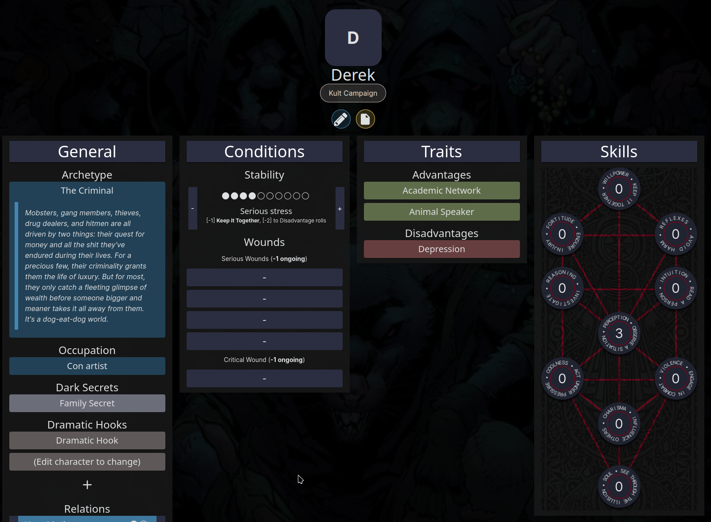
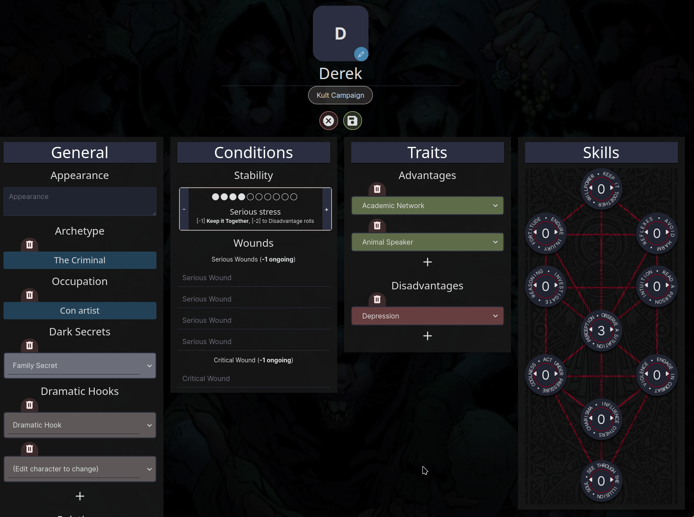

  

### Demo: https://fable-frame.online

Fable Frame is a simple project that allows you to create Tabletop RPG Character sheets online and use them during your game.

This is currently a **Work In Progress**. If you are interested - please follow up.

## Screenshots
#### Characters List

#### Kult4e Character Sheet

#### Kult4e Character Edit

#### Broken Compass Character Sheet (WIP)

## Tools and Frameworks
- Pocketbase (https://pocketbase.io)
- Sveltekit (https://kit.svelte.dev)
- Skeleton (https://www.skeleton.dev)
- Tailwindcss (https://tailwindcss.com)
